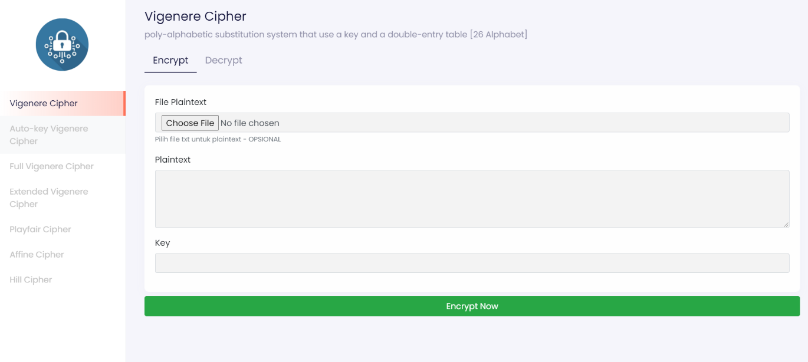
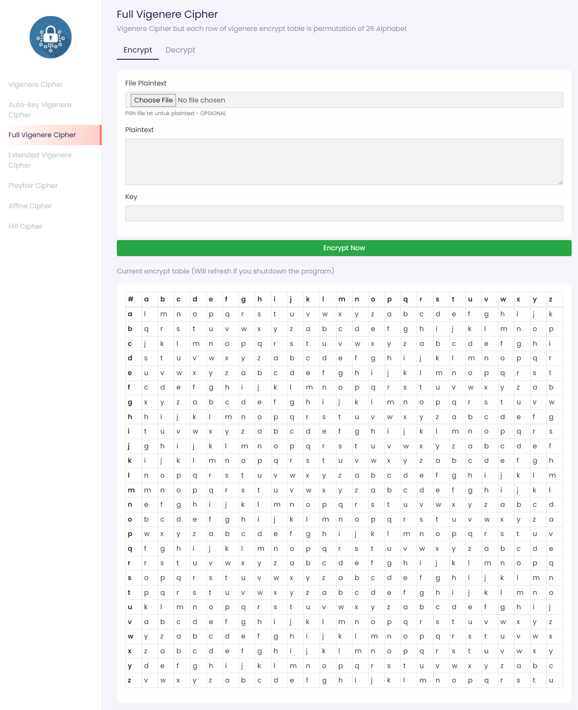
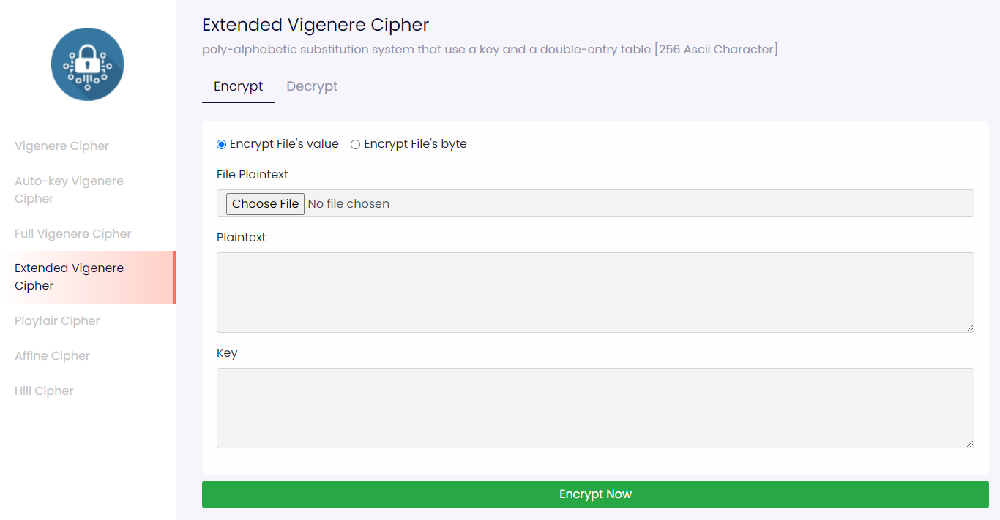
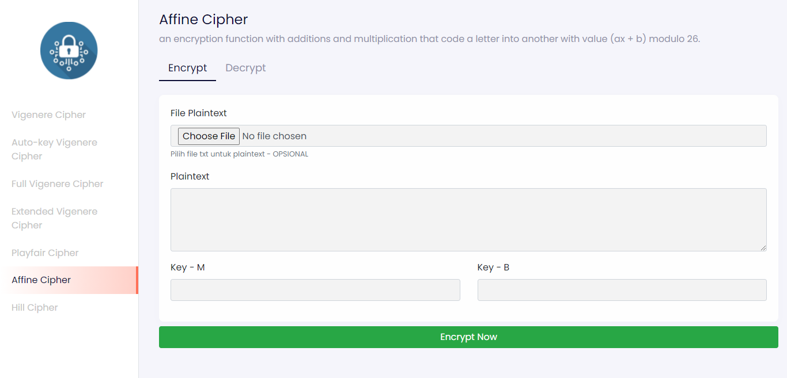
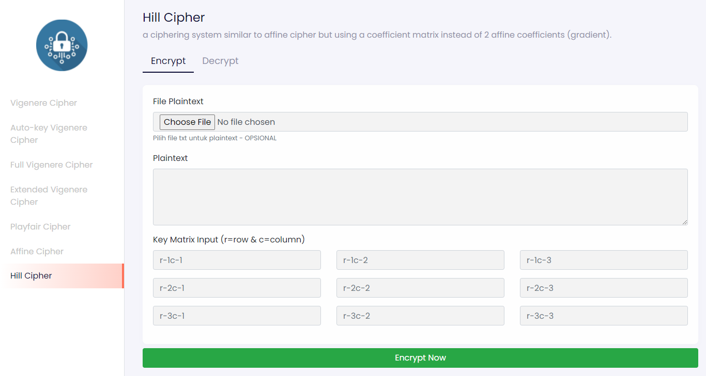

# Classic Cipher Algorithms
## Semester I Tahun 2021/2022

### Tugas Kecil I IF4020 Kriptografi

*Program Studi Teknik Informatika* <br />
*Sekolah Teknik Elektro dan Informatika* <br />
*Institut Teknologi Bandung* <br />

*Semester I Tahun 2021/2022*

## Description
Sebuah program dalam bahasa Python berbasis web dengan framework flask yang mengimplementasikan:
1. Vigenere Cipher standard (26 huruf alfabet
2. Varian Vigenere Cipher (26 huruf alfabet): 
   * Full Vigenere Cipher
   * Auto-key Vigenere Cipher)
3. Extended Vigenere Cipher (256 karakter ASCII)
4. Playfair Cipher (26 huruf alfabet)
5. Affine cipher (26 huruf alfabet)
6. Hill cipher (26 huruf alfabet).
   
## Author
1. Reihan Andhika Putra (13519043)
2. Ryo Richardo		    ( 13519193)

## Requirements
- [Python 3](https://www.python.org/downloads/)

## Installation And Run
Clone the repository
```bash
git clone https://github.com/hokkyss/Stima03_OTOBOT.git
cd src
```
### Automatic Setup
#### First Time Setup
1. Open `setup.bat`
2. Wait until the installation is finished
3. The setup will automatically open the web browser
4. If the page failed to load, wait a moment then refresh the page

#### Run
1. Open `run.bat`
2. It will automatically open the web browser
3. If the page failed to load, wait a moment then refresh the page

#### Manual Setup
After cloning the repository
```bash 
cd src
python -m venv virt
virt\Scripts\activate
pip install -r requirements.txt
python app.py
```
Then open your web browser and go to [localhost:5000](http://localhost:5000)

## Screen Capture 
### Vigenere Cipher

### Full Vigenere Cipher

### Extended Vigenere Cipher

### Affine Cipher

### Capture Hill Cipher
